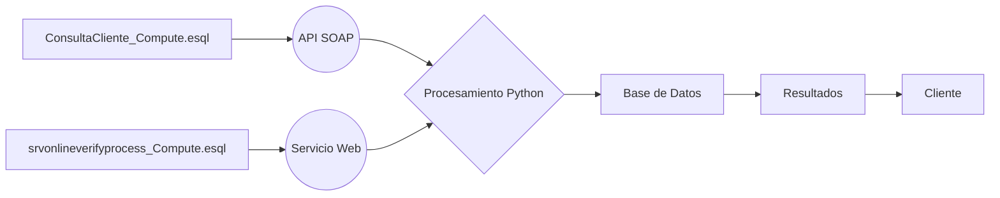

# Sistema de Integración EventStoreDB y Python


## Descripción del sistema

Este sistema está diseñado para integrar funcionalidades de procesamiento de eventos con EventStoreDB (.esql) y scripts de automatización y conexión con APIs externas utilizando Python (.py). Se utiliza principalmente para manejar y verificar datos de clientes y procesos de verificación en línea de manera eficiente y automatizada.

## Scripts .esql

### ConsultaCliente_Compute.esql
- **Propósito:** Este script maneja la consulta de datos de clientes. Extrae valores específicos de las solicitudes entrantes para procesar y validar la información del cliente.
- **Flujo de eventos:** El script recibe un mensaje SOAP, extrae los datos necesarios y los procesa para verificar la identidad del cliente y otros detalles relevantes.

### srvonlineverifyprocess_Compute.esql
- **Propósito:** Automatiza el proceso de verificación en línea de los clientes.
- **Flujo de eventos:** Recibe datos de entrada a través de un servicio web, procesa la información utilizando múltiples namespaces y realiza verificaciones contra bases de datos internas o externas.

## Scripts Python

### testapi.py
- **Funcionalidad:** Este script se utiliza para pruebas de integración con APIs externas, utilizando la clave API de OpenAI.
- **Dependencias:** `openai`, `os`

### update_readme.py
- **Funcionalidad:** Automatiza la actualización del archivo README.md del proyecto basándose en cambios detectados en el repositorio.
- **Dependencias:** `os`, `sys`, `pathlib`, `openai`

## Diagrama de interacción entre componentes



## Requisitos técnicos

- Python 3.8 o superior
- EventStoreDB 21.6.0
- Bibliotecas Python: `openai`, `os`, `sys`, `pathlib`
- Acceso a servicios web y APIs externas

## Guía de instalación/configuración

1. **Instalar Python:**
   - Descargar e instalar Python desde [python.org](https://www.python.org/downloads/).

2. **Configurar EventStoreDB:**
   - Descargar EventStoreDB desde [Event Store](https://eventstore.com/downloads/).
   - Seguir las instrucciones de instalación específicas para su sistema operativo.

3. **Instalar dependencias de Python:**
   ```bash
   pip install openai
   ```

4. **Configurar variables de entorno:**
   - Establecer `OPENAI_API_KEY` con su clave de API en el entorno de ejecución.

5. **Clonar el repositorio y configurar scripts:**
   - Ajustar rutas y parámetros según la configuración del entorno de producción o desarrollo.

## Ejemplos de uso

- **Ejecutar ConsultaCliente_Compute.esql:**
  ```sql
  EXECUTE ConsultaCliente_Compute.Main();
  ```

- **Ejecutar testapi.py:**
  ```bash
  python testapi.py
  ```

## Licencia

Este proyecto está licenciado bajo la Licencia MIT. Para más detalles, ver el archivo `LICENSE` en el repositorio.