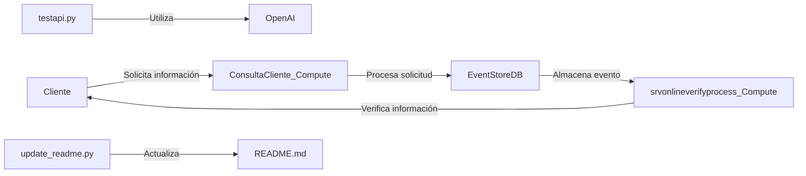

# Sistema de Integración EventStoreDB y Python


## Descripción del sistema

Este sistema combina la potencia de EventStoreDB con scripts en Python para crear una solución robusta de manejo de eventos y procesamiento de datos en tiempo real. Se utiliza para gestionar consultas y verificaciones en línea a través de servicios web, optimizando las interacciones entre clientes y verificaciones de procesos online.

### Scripts .esql

#### ConsultaCliente_Compute.esql
- **Propósito:** Este script gestiona las consultas de clientes, extrayendo y procesando la información desde solicitudes entrantes.
- **Flujo de eventos:** Recibe datos del cliente, procesa la información y envía respuestas adecuadas basadas en la consulta realizada.

#### srvonlineverifyprocess_Compute.esql
- **Propósito:** Administra la verificación de servicios en línea, asegurando que las transacciones y consultas se realicen de manera segura y eficiente.
- **Flujo de eventos:** Captura datos de la solicitud, verifica la información y retorna el estado de la verificación.

### Scripts Python

#### testapi.py
- **Funcionalidad:** Prueba las integraciones API y maneja la configuración de claves de API para desarrollo y pruebas.
- **Dependencias:** `openai`

#### update_readme.py
- **Funcionalidad:** Automatiza la actualización del archivo README.md del repositorio, utilizando la clave API de OpenAI para procesar y actualizar información.
- **Dependencias:** `openai`, `os`, `sys`, `pathlib`

## Diagrama de interacción entre componentes



## Requisitos técnicos

- Python 3.8 o superior.
- Acceso a EventStoreDB.
- Dependencias Python instaladas (`openai`).

## Guía de instalación/configuración

1. **Clonar el repositorio:**
   ```bash
   git clone https://github.com/ejemplo/sistema-integracion.git
   cd sistema-integracion
   ```

2. **Instalar dependencias Python:**
   ```bash
   pip install openai
   ```

3. **Configurar variables de entorno:**
   - Establecer `OPENAI_API_KEY` con su clave de API de OpenAI.

4. **Configurar EventStoreDB:**
   - Asegúrese de que EventStoreDB esté instalado y configurado correctamente en su entorno.

## Ejemplos de uso

### Uso de .esql
- **ConsultaCliente_Compute.esql:**
  ```sql
  -- Ejecutar en el entorno de EventStoreDB
  CALL ConsultaCliente_Compute.Main();
  ```

### Uso de Python
- **testapi.py:**
  ```python
  # Ejecutar este script para probar la configuración de la API
  python testapi.py
  ```

## Licencia

Este proyecto está licenciado bajo la Licencia MIT - vea el archivo LICENSE.md para más detalles.